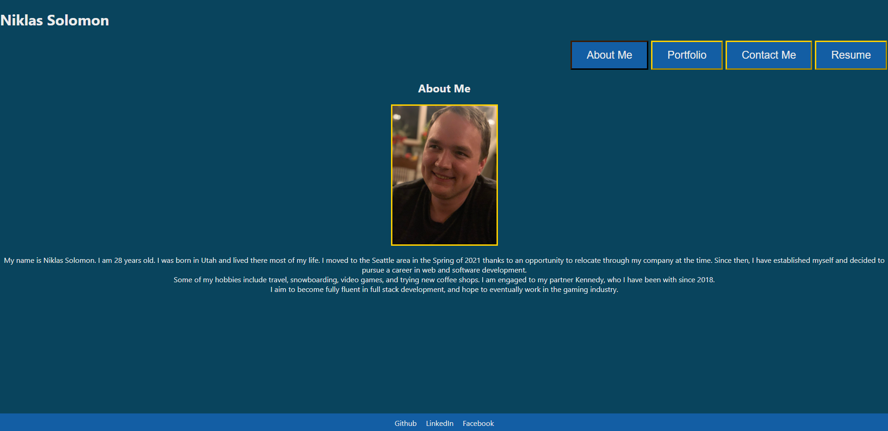

# React-Portfolio
[Link to live application](https://niklassolomon.github.io/React-Portfolio/)
## Goal:
The goal of this project was to create a portfolio showcasing past projects and providing personal information using React.

## How:
Using React as the client and Javascript to build the pages, the portfolio displays all the information in a polished UI that is responsive and easy to navigate.

[Link to Github Repository](https://github.com/NiklasSolomon/React-Portfolio)
